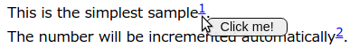
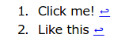

Barenote is a simple footnote library developed in JavaScript.


## Usage
First of all, prepare the envirionment according to your usage. How to prepare is described below.

After the preparation,
what you have to do is just insert a tag whose class name is `barenote` to make a footnote as follows.

   ```html
   This is the simplest sample<sup><span class='barenote'>Click me!</span></sup>.<br />
   The number will be incremented automatically<sup><span class='barenote'>Like this</span></sup>.<br />
   ```

   This is shown in browser as follows.
   When you hover the number, the floating note is shown.

   

### Basic Preparation
If your page has only one Barenote, you can apply it to `<body>`.

1. Add `barenote.min.js` to your page.
   ```html
   <script src="https://kokufu.github.io/Barenote/dist/barenote.min.js"></script>
   ```

1. Apply Barenote to body element.  
   as follows.
   ```html
   <script type='text/javascript'>
     document.addEventListener("DOMContentLoaded", function(event) {
       const body = document.querySelector('body');
       new Barenote(body);
     });
   </script>
   ```

1. Place `barenote_ref_list` where you want to show the list.
   ```html
   <div class='barenote_ref_list'></div>
   ```

   

### Multi-articles Preparation
If your page has tow or more articles which hvae footnotes,
you can apply it to each article as follows.

1. Add `barenote.min.js` to your page.
   ```html
   <script src="https://kokufu.github.io/Barenote/dist/barenote.min.js"></script>
   ```

1. Apply Barenote to each element
   as follows.
   ```html
   <script type='text/javascript'>
     document.addEventListener("DOMContentLoaded", function(event) {
       const articleA = document.querySelector('#articleA');
       new Barenote(articleA);
       const articleB = document.querySelector('#articleA');
       new Barenote(articleB);
     });
   </script>
   ```

1. Place `barenote_ref_list` within the each element where you want to show the list.
   ```html
   <div id="#articleA">
     ...
     <div class='barenote_ref_list'></div>
   </div>
   <div id="#articleB">
     ...
     <div class='barenote_ref_list'></div>
   </div>
   ```


## Examples
  - [sample01](https://kokufu.github.io/Barenote/sample/sample01.html)
    The simplest sample. There is only one barenote.  
  - [sample02](https://kokufu.github.io/Barenote/sample/sample02.html)
    There are more than two barenote in a page.  
  - [sample03](https://kokufu.github.io/Barenote/sample/sample03.html)
    Another pattern of that there are more than two barenote in a page.  
  - [sample04](https://kokufu.github.io/Barenote/sample/sample04.html)
    How to modify the floating note display.  


## Build
```console
git clone https://github.com/kokufu/Barenote
cd Barenote
npm install
npm run build
```
Then `barenote.min.js` is made in `dist` dir.
