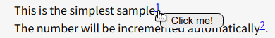
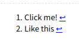

# Barenote
A simple footnote library with JavaScript.

## Build
```
$ git clone https://github.com/kokufu/Barenote.git
$ cd Barenote
$ npm run build
```
Then `barenote.min.js` is made in `dist` dir.


## Install
1. Build `barenote.min.js` as stated above or
  download `barenote.min.js` from [Release page](https://github.com/kokufu/Barenote/releases).

2. Place it on your server.

## How to use
1. Link to the `barenote.min.js` in your web page.
   This must be after jQuery inclusion.

   ```html
   <script src="barenote.min.js"></script>
   ```

1. Apply barenote to tags.  
   If your web page has only one barenote, it's the simplest way applying to `body` tag like below.

   ```html
   <script type='text/javascript'>
    document.addEventListener("DOMContentLoaded", function(event) {
      var body = document.querySelector('body');
      new Barenote(body);
    });
   </script>
   ```

1. Insert a tag whose class name is `barenote` to make a footnote like below.

   ```html
   This is the simplest sample<sup><span class='barenote'>Click me!</span></sup>.<br />
   The number will be incremented automatically<sup><span class='barenote'>Like this</span></sup>.<br />
   ```

   This is shown in browser like below.  
     
   When you hover the number, the floating note is shown.

1. Place `barenote_ref_list` where you want to show the list.

   ```html
   <div class='barenote_ref_list'></div>
   ```

   

1. See the samples  
   [sample01](https://kokufu.github.io/Barenote/sample/sample01.html)
     The simplest sample. There is only one barenote.  
   [sample02](https://kokufu.github.io/Barenote/sample/sample02.html)
     There are more than two barenote in a page.  
   [sample03](https://kokufu.github.io/Barenote/sample/sample03.html)
     Another pattern of that there are more than two barenote in a page.  
   [sample04](https://kokufu.github.io/Barenote/sample/sample04.html)
     How to modify the floating note display.  
